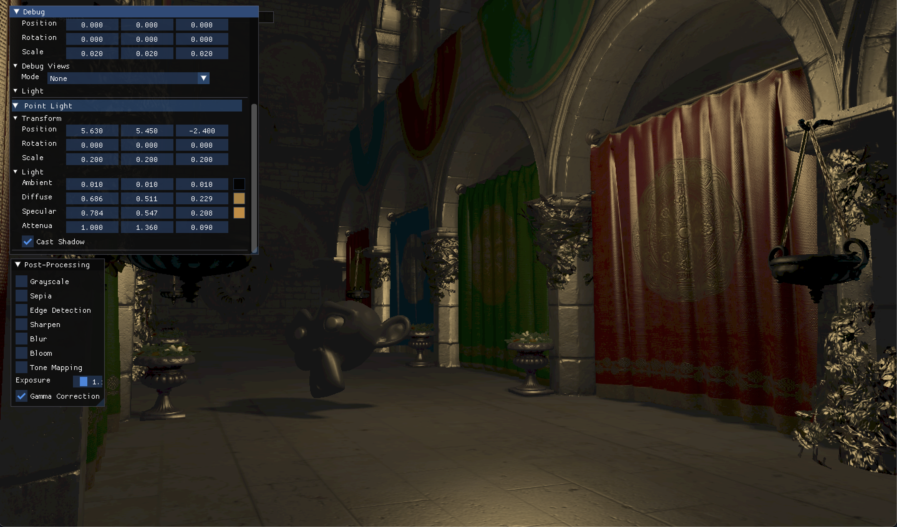

# GXEn
`GXEn` is a lightweight, modern rendering engine built on OpenGL, featuring a flexible hybrid Forward + Deferred pipeline.
It’s designed for clarity, experimentation, and real-time graphics research — without bloated abstractions.
## Features
- **Hybrid Forward / Deferred Pipeline**
  - Deferred path is fully G-Buffer based, or you can switch to Forward anytime.
- **Opaque & Transparent Rendering**
  - Opaque objects go through Deferred or Forward (depending on your selected pipeline).
  Transparent objects always render in the Forward pipeline to keep blending sane.
- **Instanced Rendering**
  - Works for both opaque and transparent objects.
- **Lighting & Shadows**
  - Directional Light + Shadow Mapping
  - Point Light + Shadow Mapping (cubemap-based)
  - Spot Light + Shadow Mapping
- **HDR Rendering**
  - Full HDR workflow ready for post-processing.
- **Entity Component System (ECS)**
  - Lightweight, simple, and gets out of your way.
- **Frustum Culling**
  - Per-entity and per-mesh culling.
- **Skybox Rendering** 
- **Advanced Materials**
  - Normal Mapping
  - Parallax Mapping
- **Rendering Infrastructure**
  - Framebuffers
  - Uniform Buffers
- **Post-Processing**
  - Modular, extendable post-FX chain (bloom, blur, tone mapping, gamma, etc.)
- **Debug Tools**
  - Normal visualization
  - Wireframe mode
- **Built-in Models**
  - Cube – perfect for testing transforms, lighting, and shadow maps
  - Cubemap – used for skybox rendering
  - Plane
  - Screen Quad – for post-processing, deferred pipeline, and blitting
## Screenshots

## Roadmap
- [ ] SSAO
- [ ] PBR materials
- [ ] Cascaded shadow maps
## License
This project is licensed under the BSD 3-Clause License. See the LICENSE file for details.